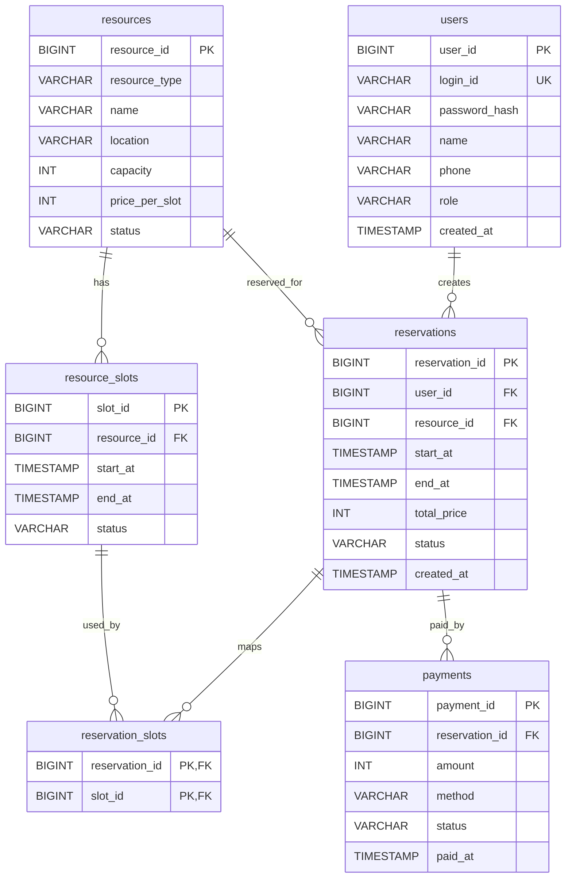

# CampusReserve 중간 수행 보고서

| 항목 | 내용 |
|---|---|
| 과목 | 웹프로그래밍-I |
| 제출 구분 | 중간 수행 보고서 |
| 제출 예정일 | 2026.06.08.(월) |
| 작성일 | 2026.06.07.(일) |
| 프로젝트명 | CampusReserve |
| 선택 주제 | 스터디룸 및 사물함 예약 시스템 |
| 팀원 | [팀원 1 이름], [팀원 2 이름] |
| 기술 스택 | Java 21 LTS, Jakarta Servlet/JSP, JSTL, JDBC, H2 Database, Tomcat 10.1.x, Maven WAR |

---

## 1. 보고서 작성 목적

본 보고서는 웹프로그래밍-I 학기말 과제의 두 번째 제출 항목인 **중간 수행 보고서(DB 설계 등)** 제출을 위해 작성하였다.

현재까지 수행한 작업은 다음 범위에 집중하였다.

- 과제 요구사항 분석 및 선택 주제 확정
- Servlet/JSP 기반 MVC 구조 설계 및 구현
- FrontController와 Command 패턴 기반 요청 분기 구현
- Service / DAO / DTO 계층 분리
- H2 Database 기반 DB 설계 및 초기 데이터 작성
- 예약 중복 방지를 위한 트랜잭션 및 DB Lock 구조 구현
- 회원, 예약, 마이페이지, 관리자 기능의 MVP 구현

본 중간 보고서에서는 현재까지의 구현 현황, MVP 범위, DB 설계, 핵심 트랜잭션 처리 방식, 향후 일정 및 보완 계획을 정리한다.

---

## 2. 프로젝트 개요

## 2.1 프로젝트명

**CampusReserve**

## 2.2 프로젝트 설명

CampusReserve는 사용자가 날짜와 시간을 선택하여 스터디룸 또는 사물함을 예약하고, Mock 결제를 진행할 수 있는 예약 시스템이다.

일반 회원은 자원 목록 조회, 예약 신청, 내 예약 조회, 취소 요청을 할 수 있다. 관리자는 전체 예약 현황, 취소 요청, 자원 배치 현황, 매출 통계를 확인할 수 있다.

## 2.3 프로젝트 목표

본 프로젝트의 목표는 Spring Framework 없이 pure Java 기반으로 웹 애플리케이션의 MVC 구조를 직접 구현하는 것이다.

주요 목표는 다음과 같다.

- `*.do` 요청을 처리하는 단일 FrontController 구현
- URI별 Command 객체 분기 처리
- JSP / EL / JSTL 기반 View 구성
- Service, DAO, DTO 계층 분리
- Tomcat JNDI DataSource와 DBCP 기반 DB 연결 관리
- JDBC 트랜잭션 기반 예약 중복 방지
- 일반 회원과 관리자 권한 분리
- JSP 파일을 `WEB-INF/views` 아래에 배치하여 직접 접근 차단

---

## 3. 과제 요구사항 반영 현황

| 과제 요구사항 | 반영 방식 | 현재 상태 |
|---|---|---|
| 스터디룸 및 사물함 예약 시스템 구현 | CampusReserve 주제로 확정 | 완료 |
| 일반 회원 / 관리자 권한 분리 | session의 `role` 값을 기준으로 MEMBER / ADMIN 구분 | 구현 완료 |
| 중복 예약 방지 | `resource_slots` 행을 `SELECT ... FOR UPDATE`로 잠근 뒤 예약 처리 | 구현 완료 |
| 마이페이지 | 본인 예약 현황 조회, 예약 취소 요청 | 구현 완료 |
| 관리자 페이지 | 대시보드, 자원 배치 현황, 전체 예약, 취소 승인/거절, 매출 통계 | 구현 완료 |
| Spring 미사용 | Servlet/JSP/JDBC 기반 직접 구현 | 준수 |
| MVC 직접 구현 | FrontController + Command + Service/DAO/DTO 구조 | 구현 완료 |
| Connection Pool 설정 | `context.xml`에 Tomcat JNDI DataSource 설정 | 구현 완료 |
| WEB-INF 보안 | JSP를 `WEB-INF/views` 하위에 배치 | 구현 완료 |

---

## 4. 확정 MVP 범위

## 4.1 MVP 정의

본 프로젝트의 MVP는 다음과 같이 정의한다.

> 사용자가 로그인 후 스터디룸 또는 사물함을 선택하여 특정 날짜와 시간에 예약하고, Mock 결제까지 완료할 수 있으며, 관리자는 전체 예약 현황과 매출 통계를 확인할 수 있는 최소 완성형 시스템

## 4.2 MVP 기능 목록 및 진행 상태

| 분류 | 기능 | 현재 상태 | 비고 |
|---|---|---|---|
| 회원 | 회원가입 | 구현 완료 | 중복 아이디 검증 포함 |
| 회원 | 로그인 | 구현 완료 | 비밀번호 해시 검증 |
| 회원 | 로그아웃 | 구현 완료 | 세션 종료 |
| 회원 | 일반 회원 / 관리자 권한 분리 | 구현 완료 | Filter와 session role 사용 |
| 자원 | 스터디룸 목록 조회 | 구현 완료 | ACTIVE 자원 조회 |
| 자원 | 사물함 목록 조회 | 구현 완료 | ACTIVE 자원 조회 |
| 예약 | 날짜별 예약 가능 시간 조회 | 구현 완료 | `resource_slots` 기준 조회 |
| 예약 | 예약 신청 | 구현 완료 | 예약, 슬롯, 결제 저장 |
| 예약 | 중복 예약 방지 | 구현 완료 | JDBC 트랜잭션 + DB Lock |
| 결제 | Mock 결제 처리 | 구현 완료 | 실제 PG 연동 제외 |
| 마이페이지 | 내 예약 현황 조회 | 구현 완료 | 본인 예약만 조회 |
| 마이페이지 | 예약 취소 요청 | 구현 완료 | 상태를 `CANCEL_REQUESTED`로 변경 |
| 관리자 | 자원 배치 현황 조회 | 구현 완료 | 날짜별 예약 상태 확인 |
| 관리자 | 전체 예약 조회 | 구현 완료 | 관리자 전용 URL |
| 관리자 | 취소 요청 승인/거절 | 구현 완료 | 승인 시 슬롯 반환 및 결제 환불 상태 처리 |
| 관리자 | 매출 통계 조회 | 구현 완료 | 일자별 / 자원별 통계 |

## 4.3 MVP 제외 기능

과제 핵심 구현 범위에 집중하기 위해 다음 기능은 MVP에서 제외하였다.

| 제외 기능 | 제외 사유 |
|---|---|
| 실제 PG 결제 API | 외부 API 연동보다 MVC, DB, 트랜잭션 구현이 과제 핵심 |
| QR 체크인 | 부가 기능이며 필수 요구사항 아님 |
| SMS 인증 | 외부 서비스 연동 필요 |
| 이메일 인증 | 외부 SMTP 설정 필요 |
| 소셜 로그인 | OAuth 구현은 과제 범위를 벗어남 |
| CSV 다운로드 | 관리자 편의 기능이지만 핵심 요구사항 아님 |
| Spring Framework / Spring Boot | 과제에서 pure Java 구현 요구 |
| JPA / Hibernate | JDBC와 DAO 직접 구현 목표와 맞지 않음 |

---

## 5. 현재까지 진행된 사항

## 5.1 문서 및 기획

| 산출물 | 경로 | 내용 |
|---|---|---|
| 과제 원문 정리 | `project.md` | 과제 주제, 수행 방법, 제출 일정 정리 |
| 프로젝트 설계 문서 | `CampusReserve_PROJECT_DESIGN.md` | 기능 정의, MVP, DB 설계, 일정, R&R 정리 |
| README | `README.md` | 프로젝트 소개, 실행 방법, 구현된 MVP, 보안 사항 정리 |
| 중간 수행 보고서 | `CampusReserve_MIDTERM_REPORT.md` | 현재 문서 |

## 5.2 프로젝트 구조 구현

현재 Maven WAR 프로젝트 구조를 구성하였다.

```text
src/main/java/com/campusreserve
├── controller
├── command
├── service
├── dao
├── dto
├── filter
├── listener
└── util

src/main/resources
├── schema.sql
└── data.sql

src/main/webapp
├── META-INF/context.xml
├── WEB-INF/web.xml
├── WEB-INF/views
└── assets/css/app.css
```

## 5.3 구현된 주요 Java 구성요소

| 계층 | 주요 파일 | 역할 |
|---|---|---|
| Controller | `FrontController.java` | 모든 `*.do` 요청 수신 및 Command 실행 |
| Command | `CommandFactory.java` | URI별 Command 객체 매핑 |
| Command | `user`, `resource`, `reservation`, `mypage`, `admin` 패키지 | 기능별 요청 처리 |
| Service | `UserService.java` | 회원가입, 로그인 비즈니스 로직 |
| Service | `ReservationService.java` | 예약 생성, 내 예약 조회, 취소 요청 |
| Service | `AdminService.java` | 관리자 대시보드, 예약 관리, 매출 통계 |
| DAO | `UserDAO.java`, `ResourceDAO.java`, `SlotDAO.java`, `ReservationDAO.java`, `PaymentDAO.java` 등 | JDBC 기반 DB 접근 |
| DTO | `UserDTO.java`, `ResourceDTO.java`, `SlotDTO.java`, `ReservationDTO.java`, `PaymentDTO.java` 등 | 계층 간 데이터 전달 |
| Filter | `EncodingFilter.java`, `LoginCheckFilter.java`, `AdminCheckFilter.java` | 인코딩, 로그인, 관리자 권한 검사 |
| Listener | `DatabaseInitializer.java` | 서버 시작 시 DB 스키마, 초기 데이터, 슬롯 생성 |
| Util | `DBUtil.java`, `PasswordUtil.java`, `CsrfTokenUtil.java` | DB 연결, 비밀번호 해시, CSRF 토큰 처리 |

## 5.4 구현된 주요 화면

| 화면 | JSP 경로 |
|---|---|
| 메인 화면 | `WEB-INF/views/index.jsp` |
| 로그인 | `WEB-INF/views/user/login.jsp` |
| 회원가입 | `WEB-INF/views/user/register.jsp` |
| 스터디룸 목록 | `WEB-INF/views/reservation/study-room-list.jsp` |
| 사물함 목록 | `WEB-INF/views/reservation/locker-list.jsp` |
| 예약 시간 선택 | `WEB-INF/views/reservation/reservation-form.jsp` |
| 예약 완료 | `WEB-INF/views/reservation/reservation-complete.jsp` |
| 내 예약 현황 | `WEB-INF/views/mypage/my-reservations.jsp` |
| 관리자 대시보드 | `WEB-INF/views/admin/dashboard.jsp` |
| 관리자 자원 배치 현황 | `WEB-INF/views/admin/resource-layout.jsp` |
| 관리자 전체 예약 | `WEB-INF/views/admin/reservations.jsp` |
| 관리자 취소 요청 관리 | `WEB-INF/views/admin/cancel-requests.jsp` |
| 관리자 매출 통계 | `WEB-INF/views/admin/sales.jsp` |

---

## 6. 시스템 아키텍처

## 6.1 전체 요청 처리 흐름

```text
Client Browser
    ↓
FrontController (*.do)
    ↓
CommandFactory
    ↓
Command
    ↓
Service
    ↓
DAO
    ↓
H2 Database
    ↓
JSP View (/WEB-INF/views)
```

## 6.2 계층별 책임

| 계층 | 책임 |
|---|---|
| FrontController | 모든 요청 수신, 공통 예외 처리, forward/redirect 처리 |
| CommandFactory | 요청 URI에 맞는 Command 객체 반환 |
| Command | request parameter 검증, Service 호출, View 결정 |
| Service | 트랜잭션, 권한, 상태 변경 등 비즈니스 로직 처리 |
| DAO | SQL 실행 및 ResultSet 매핑 |
| DTO | 계층 간 데이터 전달 |
| JSP | 화면 출력 |
| Filter | 인코딩, 로그인 여부, 관리자 권한 확인 |
| Listener | 애플리케이션 시작 시 DB 초기화 |

## 6.3 주요 URL 설계

| URL | Method | 설명 |
|---|---|---|
| `/user/register.do` | GET/POST | 회원가입 |
| `/user/login.do` | GET/POST | 로그인 |
| `/user/logout.do` | GET | 로그아웃 |
| `/resources/study-rooms.do` | GET | 스터디룸 목록 |
| `/resources/lockers.do` | GET | 사물함 목록 |
| `/reservation/form.do` | GET | 예약 시간 선택 |
| `/reservation/create.do` | POST | 예약 생성 |
| `/reservation/complete.do` | GET | 예약 완료 |
| `/mypage/reservations.do` | GET | 내 예약 현황 |
| `/mypage/cancel-request.do` | POST | 예약 취소 요청 |
| `/admin/dashboard.do` | GET | 관리자 대시보드 |
| `/admin/layout.do` | GET | 자원 배치 현황 |
| `/admin/reservations.do` | GET | 전체 예약 |
| `/admin/cancel-requests.do` | GET | 취소 요청 목록 |
| `/admin/cancel-approve.do` | POST | 취소 승인 |
| `/admin/cancel-reject.do` | POST | 취소 거절 |
| `/admin/sales.do` | GET | 매출 통계 |

---

## 7. DB 설계

## 7.1 DBMS 및 연결 방식

| 항목 | 내용 |
|---|---|
| DBMS | H2 Database |
| 사용 방식 | Embedded file mode |
| JDBC URL | `jdbc:h2:file:~/campusreserve-db/campusreserve;MODE=MySQL;DATABASE_TO_UPPER=false` |
| 연결 방식 | Tomcat JNDI DataSource |
| Connection Pool | Tomcat DBCP |
| 설정 파일 | `src/main/webapp/META-INF/context.xml` |
| 스키마 파일 | `src/main/resources/schema.sql` |
| 초기 데이터 파일 | `src/main/resources/data.sql` |

## 7.2 ERD 개념도



## 7.3 테이블 목록

| 테이블 | 설명 |
|---|---|
| `users` | 회원 정보 저장 |
| `resources` | 스터디룸 및 사물함 자원 정보 저장 |
| `resource_slots` | 자원별 예약 가능 시간대 저장 |
| `reservations` | 예약 기본 정보 저장 |
| `reservation_slots` | 예약과 시간대 slot 매핑 |
| `payments` | Mock 결제 정보 저장 |

## 7.4 테이블 상세 설계

### 7.4.1 users

| 컬럼 | 타입 | 제약조건 | 설명 |
|---|---|---|---|
| `user_id` | BIGINT | PK, AUTO_INCREMENT | 회원 식별자 |
| `login_id` | VARCHAR(50) | NOT NULL, UNIQUE | 로그인 아이디 |
| `password_hash` | VARCHAR(255) | NOT NULL | 해시된 비밀번호 |
| `name` | VARCHAR(50) | NOT NULL | 이름 |
| `phone` | VARCHAR(30) | NULL | 연락처 |
| `role` | VARCHAR(20) | NOT NULL | `MEMBER` 또는 `ADMIN` |
| `created_at` | TIMESTAMP | NOT NULL, DEFAULT CURRENT_TIMESTAMP | 가입일 |

### 7.4.2 resources

| 컬럼 | 타입 | 제약조건 | 설명 |
|---|---|---|---|
| `resource_id` | BIGINT | PK, AUTO_INCREMENT | 자원 식별자 |
| `resource_type` | VARCHAR(20) | NOT NULL | `STUDY_ROOM` 또는 `LOCKER` |
| `name` | VARCHAR(100) | NOT NULL | 자원명 |
| `location` | VARCHAR(100) | NULL | 위치 |
| `capacity` | INT | NULL | 수용 인원 |
| `price_per_slot` | INT | NOT NULL | 1시간 단위 가격 |
| `status` | VARCHAR(20) | NOT NULL | `ACTIVE` 등 |

### 7.4.3 resource_slots

| 컬럼 | 타입 | 제약조건 | 설명 |
|---|---|---|---|
| `slot_id` | BIGINT | PK, AUTO_INCREMENT | 시간대 식별자 |
| `resource_id` | BIGINT | FK, NOT NULL | 자원 식별자 |
| `start_at` | TIMESTAMP | NOT NULL | 시작 시간 |
| `end_at` | TIMESTAMP | NOT NULL | 종료 시간 |
| `status` | VARCHAR(20) | NOT NULL | `AVAILABLE`, `RESERVED` 등 |

추가 제약조건:

- `UNIQUE (resource_id, start_at, end_at)`
- 동일 자원의 동일 시간대가 중복 생성되지 않도록 제한한다.

### 7.4.4 reservations

| 컬럼 | 타입 | 제약조건 | 설명 |
|---|---|---|---|
| `reservation_id` | BIGINT | PK, AUTO_INCREMENT | 예약 식별자 |
| `user_id` | BIGINT | FK, NOT NULL | 예약 회원 |
| `resource_id` | BIGINT | FK, NOT NULL | 예약 자원 |
| `start_at` | TIMESTAMP | NOT NULL | 예약 시작 시간 |
| `end_at` | TIMESTAMP | NOT NULL | 예약 종료 시간 |
| `total_price` | INT | NOT NULL | 총 결제 금액 |
| `status` | VARCHAR(30) | NOT NULL | 예약 상태 |
| `created_at` | TIMESTAMP | NOT NULL, DEFAULT CURRENT_TIMESTAMP | 예약 생성 시각 |

### 7.4.5 reservation_slots

| 컬럼 | 타입 | 제약조건 | 설명 |
|---|---|---|---|
| `reservation_id` | BIGINT | PK, FK, NOT NULL | 예약 식별자 |
| `slot_id` | BIGINT | PK, FK, NOT NULL | 시간대 식별자 |

설계 의도:

- 현재 MVP에서는 1시간 단위 slot 1개 예약을 우선 구현한다.
- 향후 2시간 이상 연속 예약으로 확장할 경우 하나의 예약이 여러 slot을 가질 수 있도록 중간 테이블을 둔다.

### 7.4.6 payments

| 컬럼 | 타입 | 제약조건 | 설명 |
|---|---|---|---|
| `payment_id` | BIGINT | PK, AUTO_INCREMENT | 결제 식별자 |
| `reservation_id` | BIGINT | FK, NOT NULL | 예약 식별자 |
| `amount` | INT | NOT NULL | 결제 금액 |
| `method` | VARCHAR(20) | NOT NULL | Mock 결제 방식 |
| `status` | VARCHAR(20) | NOT NULL | 결제 상태 |
| `paid_at` | TIMESTAMP | NOT NULL, DEFAULT CURRENT_TIMESTAMP | 결제 시각 |

## 7.5 주요 상태값

| 구분 | 상태값 | 의미 |
|---|---|---|
| 사용자 권한 | `MEMBER` | 일반 회원 |
| 사용자 권한 | `ADMIN` | 관리자 |
| 자원 유형 | `STUDY_ROOM` | 스터디룸 |
| 자원 유형 | `LOCKER` | 사물함 |
| 자원 상태 | `ACTIVE` | 예약 가능 자원 |
| slot 상태 | `AVAILABLE` | 예약 가능 시간대 |
| slot 상태 | `RESERVED` | 예약 완료 시간대 |
| 예약 상태 | `RESERVED` | 예약 완료 |
| 예약 상태 | `CANCEL_REQUESTED` | 취소 요청 |
| 예약 상태 | `CANCELLED` | 취소 완료 |
| 결제 상태 | `PAID` | 결제 완료 |
| 결제 상태 | `REFUNDED` | 환불 처리 |

## 7.6 초기 데이터 설계

초기 자원 데이터는 `data.sql`에서 등록한다.

| 자원 유형 | 자원명 | 위치 | 가격 |
|---|---|---|---:|
| 스터디룸 | A101 프로젝트룸 | 중앙도서관 1층 | 3,000 |
| 스터디룸 | B203 그룹룸 | 중앙도서관 2층 | 4,000 |
| 스터디룸 | C305 세미나룸 | 학생회관 3층 | 5,000 |
| 사물함 | L-101 사물함 | 중앙도서관 1층 | 1,000 |
| 사물함 | L-102 사물함 | 중앙도서관 1층 | 1,000 |
| 사물함 | L-201 사물함 | 공학관 2층 | 1,000 |
| 사물함 | L-202 사물함 | 공학관 2층 | 1,000 |

서버 시작 시 `DatabaseInitializer`가 추가로 수행하는 작업은 다음과 같다.

- `schema.sql` 실행
- `data.sql` 실행
- 기본 관리자 계정 생성
- 기본 일반 회원 계정 생성
- 현재 날짜부터 14일 동안 09:00부터 18:00까지 1시간 단위 예약 slot 생성

## 7.7 기본 시연 계정

| 역할 | 아이디 | 비밀번호 |
|---|---|---|
| 관리자 | `admin` | `admin1234!` |
| 일반 회원 | `student` | `student1234!` |

---

## 8. 예약 중복 방지 설계 및 구현

## 8.1 문제 상황

같은 스터디룸 또는 사물함에 대해 두 사용자가 동일한 날짜와 시간대를 동시에 예약할 수 있다. 단순히 예약 전 조회 후 insert하는 방식은 동시 요청 상황에서 중복 예약이 발생할 수 있다.

따라서 본 프로젝트는 예약 가능 시간대를 `resource_slots` 테이블로 분리하고, 예약 생성 시 선택한 slot 행을 DB Lock으로 잠근 뒤 상태를 확인한다.

## 8.2 처리 방식

예약 생성은 `ReservationService.createReservation()`에서 하나의 JDBC 트랜잭션으로 처리한다.

```text
1. DataSource에서 Connection 획득
2. autoCommit(false)로 트랜잭션 시작
3. 선택한 slot을 SELECT ... FOR UPDATE로 조회
4. slot 상태가 AVAILABLE인지 확인
5. 자원이 ACTIVE 상태인지 확인
6. reservations 테이블에 예약 저장
7. reservation_slots 테이블에 예약-slot 매핑 저장
8. resource_slots 상태를 RESERVED로 변경
9. payments 테이블에 Mock 결제 저장
10. 모든 작업 성공 시 commit
11. 오류 발생 시 rollback
```

## 8.3 핵심 SQL

```sql
SELECT slot_id, resource_id, start_at, end_at, status
FROM resource_slots
WHERE slot_id = ?
FOR UPDATE
```

위 SQL을 통해 예약 대상 slot 행을 잠근 뒤, 해당 slot의 상태가 `AVAILABLE`일 때만 예약을 생성한다.

## 8.4 기대 효과

- 동일 자원, 동일 시간대에 대해 한 사용자만 예약 성공
- 예약 정보, slot 상태, 결제 정보가 하나의 트랜잭션으로 처리됨
- 예약 생성 중 오류 발생 시 DB 상태가 rollback되어 불완전한 예약 데이터 방지

---

## 9. 취소 요청 및 관리자 승인 설계

## 9.1 회원 취소 요청

일반 회원은 마이페이지에서 본인의 예약에 대해 취소 요청을 할 수 있다.

처리 방식:

- 사용자가 예약 취소 요청
- `reservations.status`를 `CANCEL_REQUESTED`로 변경
- 관리자가 취소 요청 목록에서 승인 또는 거절

## 9.2 관리자 취소 승인

관리자가 취소 요청을 승인하면 다음 작업을 하나의 트랜잭션으로 처리한다.

```text
1. 취소 요청 예약을 SELECT ... FOR UPDATE로 조회
2. 예약 상태를 CANCELLED로 변경
3. 연결된 slot 상태를 AVAILABLE로 변경
4. 결제 상태를 REFUNDED로 변경
5. commit
```

## 9.3 관리자 취소 거절

관리자가 취소 요청을 거절하면 예약 상태를 다시 `RESERVED`로 변경한다.

---

## 10. 보안 및 안정성 반영 사항

| 항목 | 반영 내용 |
|---|---|
| 비밀번호 저장 | 평문 저장 금지, PBKDF2-HMAC-SHA256 해시 사용 |
| 세션 고정 방지 | 로그인 성공 시 세션 재발급 |
| CSRF 방어 | POST 요청에 CSRF 토큰 포함 및 서버 검증 |
| 로그인 접근 제어 | 예약 및 마이페이지 URL은 `LoginCheckFilter`로 보호 |
| 관리자 접근 제어 | 관리자 URL은 `AdminCheckFilter`로 보호 |
| JSP 직접 접근 차단 | JSP 파일을 `WEB-INF/views` 아래에 배치 |
| 세션 쿠키 | HttpOnly 설정 |
| SameSite 쿠키 | Tomcat CookieProcessor에서 SameSite=Lax 설정 |
| DB 연결 관리 | JNDI DataSource와 Connection Pool 사용 |

---

## 11. 테스트 및 검증 계획

## 11.1 현재 검증 현황

| 항목 | 상태 | 비고 |
|---|---|---|
| 소스 구조 점검 | 완료 | 주요 패키지와 파일 확인 |
| DB 스키마 점검 | 완료 | `schema.sql` 확인 |
| 초기 데이터 점검 | 완료 | `data.sql`, `DatabaseInitializer` 확인 |
| 예약 트랜잭션 로직 점검 | 완료 | `ReservationService`, `SlotDAO` 확인 |
| 관리자 취소 처리 로직 점검 | 완료 | `AdminService` 확인 |
| Maven 패키징 검증 | 미완료 | 현재 로컬 환경에서 `mvn.cmd` 명령을 찾지 못해 실행하지 못함 |
| Tomcat 배포 검증 | 예정 | Maven 설치 또는 IDE Maven 설정 후 WAR 배포 예정 |

## 11.2 기능 테스트 계획

| 테스트 항목 | 테스트 방법 | 기대 결과 |
|---|---|---|
| 회원가입 | 신규 아이디로 가입 | `users` 테이블에 MEMBER 계정 생성 |
| 중복 아이디 가입 | 기존 아이디로 가입 | 오류 메시지 출력 |
| 로그인 | 올바른 아이디/비밀번호 입력 | session에 사용자 정보 저장 |
| 로그아웃 | 로그아웃 URL 접근 | session 종료 |
| 스터디룸 조회 | `/resources/study-rooms.do` 접근 | ACTIVE 스터디룸 목록 출력 |
| 사물함 조회 | `/resources/lockers.do` 접근 | ACTIVE 사물함 목록 출력 |
| 예약 가능 시간 조회 | 자원과 날짜 선택 | 해당 날짜 slot 목록 출력 |
| 정상 예약 | AVAILABLE slot 예약 | 예약, slot, 결제 정보 저장 |
| 중복 예약 | 이미 예약된 slot 예약 | 예약 실패 메시지 출력 |
| 동시 예약 | 두 사용자로 같은 slot 동시 예약 | 한 요청만 성공 |
| 내 예약 조회 | 마이페이지 접근 | 본인 예약만 출력 |
| 취소 요청 | 예약 취소 요청 | 예약 상태 `CANCEL_REQUESTED` 변경 |
| 관리자 예약 조회 | 관리자 전체 예약 페이지 접근 | 전체 예약 목록 출력 |
| 일반 회원 관리자 접근 | MEMBER 계정으로 관리자 URL 접근 | 접근 차단 |
| 취소 승인 | 관리자 취소 승인 | 예약 `CANCELLED`, slot `AVAILABLE`, 결제 `REFUNDED` |
| 취소 거절 | 관리자 취소 거절 | 예약 상태 `RESERVED` 복구 |
| 매출 통계 | 관리자 매출 통계 접근 | 일자별/자원별 결제 합계 출력 |

---

## 12. 남은 작업 및 일정

## 12.1 중간 제출 직후 보완 작업

| 기간 | 작업 |
|---|---|
| 2026.06.08 | 중간 수행 보고서 제출 |
| 2026.06.09 ~ 2026.06.10 | Maven/Tomcat 실행 환경 점검 및 WAR 배포 검증 |
| 2026.06.11 ~ 2026.06.13 | 화면 UI 보완, 입력 검증 메시지 정리 |
| 2026.06.14 ~ 2026.06.16 | 관리자 화면 사용성 보완 및 매출 통계 검증 |
| 2026.06.17 ~ 2026.06.18 | 중복 예약 수동 테스트 및 오류 수정 |
| 2026.06.19 ~ 2026.06.20 | 최종 테스트 결과 캡처 |
| 2026.06.21 | 최종보고서 및 발표자료 작성 |
| 2026.06.22 | 결과 발표 및 최종 제출 |

## 12.2 향후 보완 예정 사항

- Maven 또는 IDE 기반 빌드 환경 확인
- Tomcat 10.1.x 배포 후 실제 화면 시연 검증
- 중복 예약 동시성 테스트 캡처 확보
- 관리자 매출 통계 결과 캡처 확보
- 예외 메시지와 사용자 안내 문구 정리
- 최종보고서용 화면 캡처 및 시연 시나리오 작성

---

## 13. 위험 요소 및 대응 방안

| 위험 요소 | 영향 | 대응 방안 |
|---|---|---|
| Maven 실행 환경 미설정 | WAR 패키징 지연 | Maven 설치 또는 IDE 내 Maven 기능 사용 |
| Tomcat JNDI DataSource 설정 오류 | DB 연결 실패 | `context.xml`, `web.xml`, H2 Driver 배포 여부 확인 |
| H2 `FOR UPDATE` 동작 차이 | 중복 예약 검증 필요 | 수동 동시성 테스트로 실제 동작 확인 |
| JSP/JSTL 의존성 문제 | 화면 렌더링 오류 | Tomcat 10.1과 Jakarta JSTL 버전 호환성 확인 |
| DB 초기화 중복 실행 | 초기 데이터 중복 가능 | `MERGE`, `NOT EXISTS`, UNIQUE 제약조건으로 방지 |

---

## 14. 중간 결론

현재 CampusReserve 프로젝트는 과제에서 요구한 핵심 구조와 DB 설계를 대부분 구현한 상태이다.

특히 중간 제출의 핵심인 DB 설계 측면에서 `users`, `resources`, `resource_slots`, `reservations`, `reservation_slots`, `payments` 테이블을 구성하였고, 예약 가능 시간대를 별도 slot으로 관리하여 중복 예약 방지 로직을 구현하였다.

또한 과제 조건에 맞게 Spring Framework 없이 Servlet/JSP 기반 MVC 구조를 직접 구현하였으며, FrontController, Command, Service, DAO, DTO 계층을 분리하였다. 회원/관리자 권한 분리, 마이페이지, 관리자 화면, 매출 통계 등 MVP에 필요한 주요 기능도 소스 기준으로 구현되어 있다.

남은 주요 작업은 실제 Tomcat 배포 검증, 중복 예약 동시성 테스트, UI 보완, 최종 보고서 및 발표자료 작성이다.

---

## 15. 참고한 로컬 산출물

| 파일 | 활용 내용 |
|---|---|
| `project.md` | 과제 요구사항 및 제출 일정 확인 |
| `README.md` | 프로젝트 개요, MVP, 기술 스택, 구현 현황 확인 |
| `CampusReserve_PROJECT_DESIGN.md` | 설계 기준, 기능 정의, DB 설계, 일정 확인 |
| `src/main/resources/schema.sql` | 실제 DB 테이블 구조 확인 |
| `src/main/resources/data.sql` | 초기 자원 데이터 확인 |
| `src/main/java/com/campusreserve/service/ReservationService.java` | 예약 트랜잭션 구현 확인 |
| `src/main/java/com/campusreserve/dao/SlotDAO.java` | `SELECT ... FOR UPDATE` 구현 확인 |
| `src/main/java/com/campusreserve/service/AdminService.java` | 취소 승인/거절 트랜잭션 확인 |
| `src/main/webapp/WEB-INF/web.xml` | FrontController, Filter, Listener, DataSource 참조 확인 |
| `src/main/webapp/META-INF/context.xml` | H2 DataSource 및 CookieProcessor 설정 확인 |
